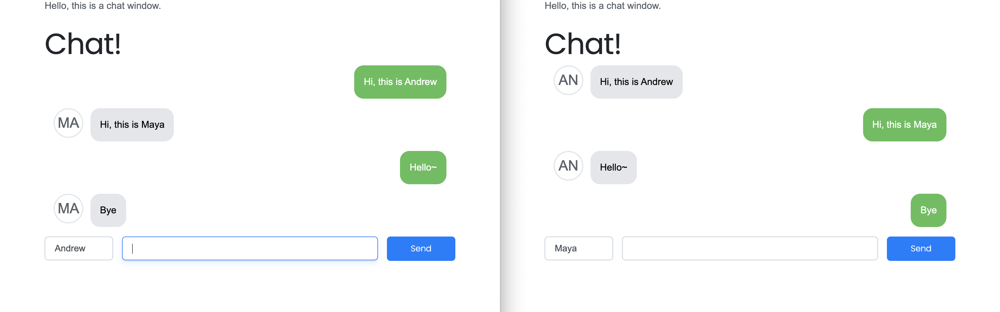

# Konnect
> A real-time chat app built using [React](https://reactjs.org/), [GraphQL](https://graphql.org/), Websockets.

[![NPM Version][npm-image]][npm-url]

A real-time chat application with React, Apollo, GraphQL Subscriptions, Websockets and Module Federation.



## Installation
Clone the git repo:
```sh
git clone git@github.com:itsandrewhong/Konnex.git
```

To start a server:
```sh
cd server
yarn start
```

To start a client:
```sh
cd client
yarn start
```

To start a homepage:
```sh
cd home-page
yarn start
```

## To-Dos
- [ ] Encrypt the messages that the users send to the server
- [ ] Add a list-box with the user in the room
- [ ] Add multiple chat rooms
- [ ] Server act like an IRC bot and -block some users-do some special actions on certain commands
- [ ] Better connection handling

## Release History
* 0.1.0
    * The first proper release
    * CHANGE: Rename repository name Konnex to Konnect
* 0.0.1
    * Work in progress

## Meta
- Andrew Hong – hello@andrewhong.tech
- Distributed under the XYZ license. See ``LICENSE`` for more information.
- [https://github.com/itsandrewhong/konnect](https://github.com/itsandrewhong/)

## Contributing
1. Fork it (<https://github.com/itsandrewhong/konnect/fork>)
2. Create your feature branch (`git checkout -b feature/fooBar`)
3. Commit your changes (`git commit -am 'Add some fooBar'`)
4. Push to the branch (`git push origin feature/fooBar`)
5. Create a new Pull Request

<!-- Markdown link & img dfn's -->
[npm-image]: https://img.shields.io/npm/v/datadog-metrics.svg?style=flat-square
[npm-url]: https://npmjs.org/package/datadog-metrics
[npm-downloads]: https://img.shields.io/npm/dm/datadog-metrics.svg?style=flat-square
[travis-image]: https://img.shields.io/travis/dbader/node-datadog-metrics/master.svg?style=flat-square
[travis-url]: https://travis-ci.org/dbader/node-datadog-metrics